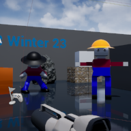

# Project Name  COMP3023w23

## Description

A github repository for the in class demonstrations.   

Attributions:
- Field of dreams background music, OpenGameArt.org,  ( https://opengameart.org/content/the-field-of-dreams )
- Bubble popping noise, OpenGameArt.org, ( https://opengameart.org/content/bubbles-pop )
- Clanking noise, Brian Macintosh, OpenGameArt.org, ( https://opengameart.org/content/metal-impact-sounds )
- Mountain scene background, Pexels, ( https://www.pexels.com/photo/landscape-photography-of-snowy-mountain-1366919/ )

## Usage
Clone, or download the zip, to a local directory. Open in Unreal Engine 4.27 or newer

